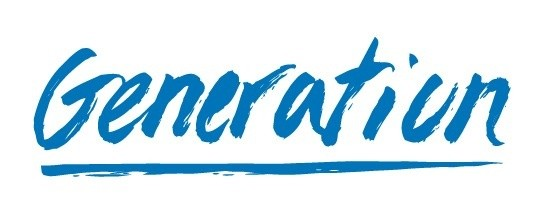

# Manos a la obra 

Este repositorio almacena el código fuente correspondiente al **FrontEnd** del proyecto integrador **Manos a la Obra** realizado por el equipo de **Alebirjes Full Stack** durante la Cohorte 39 del BootCamp **Desarrollador(a) Java Full Stack** impartido por **Generation México**.   

    

## Resumen del Proyecto:
El proyecto consiste en crear el **FrontEnd** y **BackEnd ** de una plataforma web tipo ecommerce enfocada en la venta de artesanías mexicanas. El objetivo principal del proyecto es ofrecer a los artesanos una actualización en su modelo de negocios para obtener un mayor alcance de ventas, generando nuevas oportunidades para incrementar sus ingresos económicos y mejorar su calidad de vida. 

    

## Sobre Alebrijes Full Stack
**Alebrijes Full Stack** es un equipo de desarrolladores(as) mexicanos(as) conformado por: 
- [Asbel Torales](https://www.linkedin.com/in/asbeltorales "Asbel Torales")
- [David Salvatori](http://facebook.com "David Salvatori")
- [David Ortiz](https://www.linkedin.com/in/david-ortiz-campos "David Ortiz")
- [Diana López](https://www.linkedin.com/in/diana-mariela-l%C3%B3pez-ortiz-a39a481ba "Diana López")
- [Eduardo Sosa](https://www.linkedin.com/in/eduardo-sosa-fullstack "Eduardo Sosa")
- [Jorge Nichols](https://www.linkedin.com/in/jorge-nichols-antonio-villalobos "Jorge Nichols")
- [Sergio Cruz](https://www.linkedin.com/in/sergioce "Sergio Cruz")

## Tecnologías utilizadas en el FrontEnd
1. HTML5
2. CSS3
3. BootStrap
4. JavaScript